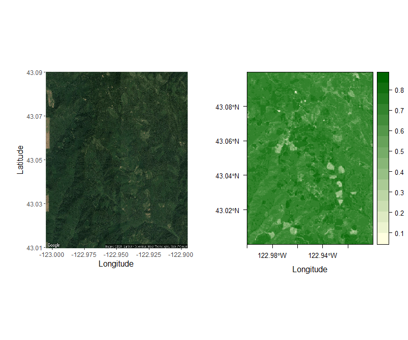

```{r, include = FALSE}
knitr::opts_chunk$set(
  collapse = TRUE,
  comment = "#>"
)
```

```{r setup, include=FALSE}
knitr::opts_chunk$set(echo = TRUE)
```

## *geodiv* R package vignette

*geodiv* is an R package that provides methods for calculating gradient surface metrics for continuous analysis of landscape features. There are a couple of ways to download and install the *geodiv* R package. You can install the released version of *geodiv* from CRAN with:

```{r, eval=FALSE}
install.packages("geodiv")
```

And the development version from GitHub with:

```{r, eval=FALSE}
install.packages("devtools")
devtools::install_github("bioXgeo/geodiv")
``` 

Note that Mac OS users may need to install the development tools here to get the package to install:

https://cran.r-project.org/bin/macosx/tools/

To begin, let's load the necessary packages for the examples that follow.

```{r package code for show, eval = FALSE}
library(geodiv)
library(raster)
library(rasterVis)
library(mapdata)
library(maptools)
library(rgeos)
library(ggplot2)
library(tidyverse)
library(parallel)
library(sf)
library(rasterVis)
library(ggmap)
library(corrplot)
library(gridExtra)
library(cowplot)
library(factoextra)
library(cluster)
```

```{r run packages, results='asis', echo=FALSE, include=FALSE,}
knitr::opts_chunk$set(echo = TRUE, warning=FALSE)
library(geodiv)
library(raster)
library(rasterVis)
library(mapdata)
library(maptools)
library(rgeos)
library(ggplot2)
library(tidyverse)
library(parallel)
library(sf)
library(rasterVis)
library(ggmap)
library(corrplot)
library(gridExtra)
library(cowplot)
library(factoextra)
library(cluster)
```
# Example 1: Simple workflow with Landsat NDVI

The National Aeronautics and Space Administration (NASA) has been collecting Earth observing images with Landsat for decades. Normalized Difference Vegetation Index (NDVI) is a measure of vegetation or greenness that can be quantified from Landsat images by measuring the difference between near-infrared and red light, which vegetation strongly reflects and absorbs, respectively. For this first example, we generated an NDVI image over a small region in southwestern Oregon using Google Earth Engine. This image is available as a raster layer available as an R data object entitled 'orforest' when *geodiv* is installed. Google Earth Engine already has a number of tutorials and sample code and functions for this step that can be accessed on its site: earthengine.google.com. Given that the focus of this tutorial is on the use of the *geodiv* R package, we provide these data already generated in Google Earth Engine.

Let's begin by loading the example data, which is a raster layer called 'orforest'.
```{r, echo=TRUE}
# Load the orforest data into your active session.
data(orforest)
# check out the properties of the orforest raster layer.
orforest
```

Let's first plot the data without any trends removed.

```{r, echo=TRUE}
# plot without trend removed
eviCols <- colorRampPalette(c('lightyellow1', 'darkgreen'))(100)
eviTheme <- rasterVis::rasterTheme(region = eviCols)
orig_ndvi <- rasterVis::levelplot(orforest, margin = F, par.settings = eviTheme, xlab = 'Longitude', ylab = 'Latitude', main='orforest original')
orig_ndvi
```

Use the 'remove_plane' function of geodiv to remove the best fit polynomial plane from the image.

```{r, echo=TRUE}
# plot with trend removed 
orfor_rem <- remove_plane(orforest)
orig_rem_plot <- rasterVis::levelplot(orfor_rem, margin = F, par.settings = eviTheme, xlab = 'Longitude', ylab = 'Latitude', main='orforest trend removed')
orig_rem_plot
```

You can also plot the raw satellite image (as opposed to the NDVI extracted from the Landsat image). To do this, create a Google Maps API key and copy to the indicated location. 

```{r, echo=TRUE}
# Plot actual satellite image.
lon <- mean(coordinates(orforest)[,1], na.rm = TRUE)
lat <- mean(coordinates(orforest)[,2], na.rm = TRUE)
api_key <- NA # ADD AN API KEY HERE
```
```{r private API key, echo = FALSE}
# api_key <- # PRIVATE API KEY FOR VIGNETTE
```

Once an API key has been inserted, run the following code to get the satellite image next to the original NDVI image.

```{r remainder of mapping, echo = TRUE, eval = FALSE}
register_google(api_key)
img <- get_map(c(lon, lat), zoom = 13, maptype = 'satellite', source = "google")
bbpoly <- data.frame(x = c(-122.9, -122.9, -123.00002, -123.00002), y = c(43.00002, 43.1, 43.1, 43.00002))
satimg <- ggmap(img) + coord_fixed(1.7) + xlab('Longitude') + ylab('Latitude') +
  theme(axis.title.x = element_text(size = 12),
        axis.title.y = element_text(size = 12),
        plot.margin = unit(c(0,0,0,0), "cm"))

plot_grid(satimg, orig_ndvi, ncol = 2, nrow = 1, scale = c(0.84, 1))
```

```{r figurename, echo=FALSE, out.width = '90%'}

```

### Calculate some surface gradient metrics for the orforest raster image.
The 'sa' function calculates the average roughness of a surface as the absolute deviation of surface heights from the mean surface height. The 'sbi' function calculates the surface bearing index, which is the ratio of the root mean square roughness (Sq) to height at 5% of bearing area (z05). The 'std' function calculates texture direction metrics (i.e., the angle of dominating texture and the texture direction of the Fourier spectrum image calculated from the orforest image). The 'sfd' function calculates the fractal dimension of the raster (i.e., the 3D fractal dimension using the triangular prism surface method).  

```{r, echo=TRUE}
sa <- sa(orforest)
sbi <- sbi(orforest)
std <- std(orforest, plot = FALSE)[[1]]
sfd <- sfd(orforest)
```

### Generate texture images for the orforest raster image.
Note that this step can be computationally intensive, so there is an option for running the code in parallel. Also, below this chunk we provide some code to read in files that contain the output rasters of these lines of code in case it is helpful for you.

```{r, eval = FALSE}
sa_img <- texture_image(orforest, window_type = 'square', size = 7, in_meters = FALSE, epsg_proj = 5070, metric = 'sa', args = NULL, parallel=FALSE)
sbi_img <- texture_image(orforest, window_type = 'square', size = 7, in_meters = FALSE, epsg_proj = 5070, metric = 'sbi', args = NULL)
std_img <- texture_image(orforest, window_type = 'square', size = 7, in_meters = FALSE, epsg_proj = 5070, metric = 'std', args = NULL)
sfd_img <- texture_image(orforest, window_type = 'square', size = 7, in_meters = FALSE, epsg_proj = 5070, metric = 'sfd', args = NULL)
```

Note that generating the texture images can take a while on a single processor, so we have provided the rasters generated for the following objects in case that is helpful: sa_img, sbi_img, std_img, and sfd_img. The code below reads these provided rasters into your R session. Note that you will need to ensure that the working directory for your session is set to the same directory where you have put these downloaded files if you do not run the texture image code yourself.

```{r, echo=TRUE, warning=FALSE}
# The below line of code will need to be modified to match the directory on the user's machine that contains the vignette files if the texture_image function has not been run in completion during the user's current session.
sa_img <- raster('sa_img_450m.tif')
sbi_img <- raster('sbi_img_450m.tif')
std_img <- raster('std_img_450m.tif')
sfd_img <- raster('sfd_img_450m.tif')
```
 
Now reproject the rasters back to their original projection.

```{r, warning=FALSE}
# reproject back to original
sa_reproj <- projectRaster(from = sa_img, to = orforest, method = 'bilinear')
sbi_reproj <- projectRaster(sbi_img, orforest)
std_reproj <- projectRaster(std_img[[1]], orforest)
sfd_reproj <- projectRaster(sfd_img, orforest)
```

Plot the reprojected texture image rasters.

```{r, eval=TRUE}
# plots
sa_plt <- rasterVis::levelplot(sa_reproj, margin = F, par.settings = eviTheme, ylab = NULL, xlab = NULL, main = 'Sa')
sbi_plt <- rasterVis::levelplot(sbi_reproj, margin = F, par.settings = eviTheme, ylab = NULL, xlab = NULL, main = 'Sbi')
std_plt <- rasterVis::levelplot(std_reproj, margin = F, par.settings = eviTheme, ylab = NULL, xlab = NULL, main = 'Std')
sfd_plt <- rasterVis::levelplot(sfd_reproj, margin = F, par.settings = eviTheme, ylab = NULL, xlab = NULL, main = 'Sfd')

# export as one
grid.arrange(sa_plt, sbi_plt, std_plt, sfd_plt, nrow = 2)
```
## Example 2: Applying all surface metrics across the entire state of Oregon, USA

### Motivation
By assessing heterogeneity using a variety of metrics, researchers can gain a more complete picture of heterogeneity than they would with a single metric (Dahlin, 2016). To demonstrate the utility of geodiv for this common application, in Example 2 we apply all surface metric functions to images across Oregon, USA and examine the patterns of, and relationships among, metrics. We will calculate metrics for both elevation data from the Shuttle Radar Topography Mission (SRTM) and a commonly-used measure of canopy greenness, Enhanced Vegetation Index (EVI) from NASA's Moderate Resolution Imaging Spectroradiometer (MODIS). We then examine the correlations among metrics along a transect crossing the state, and determined how the metrics cluster using two methods, hierarchical clustering and Principal Components Analysis (PCA).

### Elevation and EVI Data
Elevation and EVI data that are available to use along with this vignette were prepared in Google Earth Engine (Gorelick et al., 2017) and analyzed in R. Void-filled SRTM data (Farr et al., 2007) and quality-filtered, maximum growing season, MODIS EVI data (Didan, 2015) were downloaded in Fall 2019.  The code chunk below loads these data into the current R session.

```{r, warning=FALSE}
# The below line of code will need to be modified to match the directory on the user's machine that contains the vignette files for this code chunk to run.
elev <- raster('oregon_SRTM_elevation_2000.tif')
evi <- raster('oregon_max_growing_season_EVI_2000_2019.tif') * 0.0001
```

Aggregate both datasets to ~2km resolution for comparison between datasets and to reduce computational time. 

```{r, warning=FALSE}
elev <- aggregate(elev, fact = 8)
evi <- aggregate(evi, fact = 8)
```

### Pre-processing of rasters

Begin by masking any values that are outside of the boundaries for the state of Oregon.

```{r, warning=FALSE}
state <- maps::map(database = 'state', regions = 'oregon', fill = TRUE, plot = FALSE)
statePoly <- map2SpatialPolygons(state, IDs = state$names, proj4string = CRS(proj4string(evi)))
evi <- mask(x = evi, mask = statePoly)
elev <- mask(x = elev, mask = statePoly)
```

Generate some plots to get a sense for the spatial patterns in the data.

```{r, warning=FALSE}
# plot maximum growing season EVI for Oregon
rasterVis::levelplot(evi, margin = F, par.settings = eviTheme, ylab = NULL, xlab = NULL, main = 'Maximum Growing Season EVI')

# plot elevation (in meters) for Oregon
elevCols <- colorRampPalette(c('grey7', 'grey93'))(100)
elevTheme <- rasterVis::rasterTheme(region = elevCols)
rasterVis::levelplot(elev, margin = F, par.settings = elevTheme, ylab = NULL, xlab = NULL, main = 'Elevation (m)')
```

Remove any trends in the data with the 'remove_plane' function and take a look at the plots of the images with the trends removed.

```{r, warning=FALSE}
evi <- remove_plane(evi)
elev <- remove_plane(elev) # there was no trend

# plot again to see what the new raster looks like
rasterVis::levelplot(evi, margin = F, par.settings = eviTheme, ylab = NULL, xlab = NULL, main = 'EVI without Trend')
rasterVis::levelplot(elev, margin = F, par.settings = elevTheme, ylab = NULL, xlab = NULL, main = 'Elevation without Trend')
```

### Generate texture images of the state of Oregon

Below we generate a texture image for the state of Oregon using the sa metric for elevation. Note that the following step is computationally intensive and may take some time. We provide the output dataframe files along with this vignette for all metrics included in geodiv for elevation and EVI over ~30km x 30km square moving windows and scaled following calculation for the subsequent analyses in this vignette.

```{r, eval=FALSE}
# Calculate elevation sa texture image for state of Oregon
outrast <- texture_image(elev, window_type = 'square', size = 7, in_meters = FALSE, epsg_proj = 5070, metric = 'sa') 
```

The code below illustrates how to convert the raster generated by the texture_image function (i.e., outrast) to a dataframe for subsequent analyses.

```{r, eval=FALSE}
# get raster values
vals <- outrast[]

# Convert output raster of sa metrics (outrast) to a dataframe for easier use in subsequent analyses
sa_data_elev <- data.frame(x = coordinates(outrast)[,1], y = coordinates(outrast)[,2], v = vals)
```

Generating these data frames can take a while, so we have provided .csv files for all gradient surface metrics calculated for elevation and EVI in case you find them useful for working with this vignette. The below code reads in these provided .csv files.

```{r, warning=FALSE}
# Read in dataframes containing state of Oregon texture image outputs for EVI and elevation.
data_evi <- read.csv('evi_variables.csv', stringsAsFactors = FALSE)
data_elev <- read.csv('elevation_variables.csv', stringsAsFactors = FALSE)
```

### Visualization of texture image outputs for elevation and EVI for the state of Oregon

Distributions of a few elevation variables:

```{r, warning=FALSE}
# Histogram of average roughness of a surface (Sa) of elevation
hist(data_elev$sa, breaks = 30, xlab='Elevation Average Surface Roughness (Sa)', main='')
# Histogram of average roughness of the elevation surface (Sa) 
hist(data_elev$sbi, breaks = 30, xlab='Elevation Surface Bearing Index (Sbi)', main='')
# Histogram of fractal dimension of the elevation raster 
hist(data_elev$sfd, breaks = 30, xlab='Fractal Dimension of Elevation', main='')
# Histogram of texture dimension of elevation
hist(data_elev$std, breaks = 30, xlab='Texture Dimension of Elevation', main='')
```

The code below visualizes metrics over the entire state in order to capture different aspects of landscape heterogeneity. Individual metrics primarily distinguished mountainous versus flat terrain, and managed versus more natural areas; however, some metrics are difficult to interpret, or do not show very much variation over the region. The difficulty of interpreting metrics is a known complicating factor for their use. Others have addressed this issue and linked metrics with known ecosystem features or patch metrics (McGarigal et al., 2009; Kedron et al., 2018).

```{r, warning=FALSE}
# Create plots of all possible surface gradient metrics that geodiv calculates for elevation and EVI.
elev_maps <- list()
elev_names <- c('Shw', 'Srw', 'Srwi', 'Std', 'Stdi', 'S10z', 'Sa', 'Sbi', 'Sci', 'Sdc 50-55%', 'Sdc 80-85%', 'Sdc 0-5%', 'Sdq6', 
                'Sdr', 'Sds', 'Sfd', 'Sk', 'Sku', 'Smean', 'Sp', 'Spk', 'Sq', 'Ssc', 'Ssk', 'Sv', 'Svi', 'Svk')
for (i in seq(3, ncol(data_elev))) {
  cat('Creating map for var: ', names(data_elev)[i], '\n', sep = '')
  temp <- setValues(elev, data_elev[,i])
  temp[is.na(elev)] <- NA
  goodname <- elev_names[i-2]
  elev_maps[[i - 2]] <- rasterVis::levelplot(temp, margin = F, par.settings = elevTheme, ylab = NULL, xlab = NULL, main = goodname)
  elev_maps[[i-2]]$par.settings$layout.heights[
    c( 'bottom.padding',
       'top.padding',
       'key.sub.padding',
       'axis.xlab.padding',
       'key.axis.padding',
       'main.key.padding') ] <- 1
  elev_maps[[i-2]]$aspect.fill <- TRUE
}

evi_maps <- list()
evi_names <- c('S10z', 'Sa', 'Sbi', 'Sci', 'Sdc 50-55%', 'Sdc 80-85%', 'Sdc 0-5%', 'Sdq6', 'Sdr', 'Sds', 'Sfd', 'Shw', 'Sk', 'Sku', 'Smean', 
               'Sp', 'Spk', 'Sq', 'Srw', 'Srwi', 'Ssc', 'Ssk', 'Std', 'Stdi', 'Sv', 'Svi', 'Svk')
for (i in seq(3, ncol(data_evi))) {
  cat('Creating map for var: ', names(data_evi)[i], '\n', sep = '')
  temp <- setValues(evi, data_evi[,i])
  temp[is.na(evi)] <- NA
  goodname <- evi_names[i-2]
  evi_maps[[i - 2]] <- rasterVis::levelplot(temp, margin = F, par.settings = eviTheme, ylab = NULL, xlab = NULL, main = goodname)
  evi_maps[[i-2]]$par.settings$layout.heights[
    c( 'bottom.padding',
       'top.padding',
       'key.sub.padding',
       'axis.xlab.padding',
       'key.axis.padding',
       'main.key.padding') ] <- 1
  evi_maps[[i-2]]$aspect.fill <- TRUE
}

# create 3x4 panels (x3 for each)
grid.arrange(grobs = elev_maps[1:12], nrow = 4, ncol = 3) # 850x800
grid.arrange(grobs = elev_maps[13:24], nrow = 4, ncol = 3) # 850x800
grid.arrange(grobs = elev_maps[25:27], nrow = 4, ncol = 3) # 850x800

grid.arrange(grobs = evi_maps[c(12, 19, 20, 23, 24, seq(1,7))], nrow = 4, ncol = 3) # 850x800
grid.arrange(grobs = evi_maps[c(seq(8, 11), 13, 14, 15, 16, 17, 18, 21, 22)], nrow = 4, ncol = 3) # 850x800
grid.arrange(grobs = evi_maps[c(25, 26, 27)], nrow = 4, ncol = 3) # 850x800
```

## Transect analysis
In the code below, We examine an example of local correlation and clustering among the surface gradient metrics by extracting values over a horizontal transect across central Oregon. 

First we convert the raw elevation and EVI data from the NASA's SRTM and MODIS mission, respectively, to a dataframe and add those raw values to the dataframes for EVI and elevation containing the gradient surface metrics we've calculated across the state of Oregon.

```{r, warning=FALSE}
elev <- raster('oregon_SRTM_elevation_2000.tif')
evi <- raster('oregon_max_growing_season_EVI_2000_2019.tif') * 0.0001

# Coarsen resolution to 2km
elev <- aggregate(elev, fact = 8)
evi <- aggregate(evi, fact = 8)

# convert to data frame
elev_pixdf <- as(elev, "SpatialPixelsDataFrame")
elev_df <- as.data.frame(elev_pixdf)
colnames(elev_df) <- c("value", "x", "y")
evi_pixdf <- as(evi, "SpatialPixelsDataFrame")
evi_df <- as.data.frame(evi_pixdf)
colnames(evi_df) <- c("value", "x", "y")

# add raw values to other metric dataframe
data_evi$evi <- evi_df$value
data_elev$elev <- elev_df$value
```

Now let's extract the data along a latitudinal transect going across the state of Oregon.

```{r, warning=FALSE}
# Calculate the closest y value to the mean and then select all pixels along that line.
evi_crop <- crop(evi, extent(evi, round(nrow(evi) / 2) - 7, round(nrow(evi) / 2) + 7, 1, ncol(evi)))
elev_crop <- crop(elev, extent(elev, round(nrow(elev) / 2) - 7, round(nrow(elev) / 2) + 7, 1, ncol(elev)))
central_y_evi <- unique(coordinates(evi_crop)[,2])[8]
central_y_elev <- unique(coordinates(elev_crop)[,2])[8]
central_y_evi <- unique(data_evi$y[near(data_evi$y, central_y_evi, 0.01)])[1]
central_y_elev <- unique(data_elev$y[near(data_elev$y, central_y_elev, 0.01)])[1]

# Extract mean EVI and elevation values by column
evi_means <- colMeans(as.matrix(evi_crop), na.rm = TRUE)
elev_means <- colMeans(as.matrix(elev_crop), na.rm = TRUE)

# Now limit the dataframe to those points in space
transect_evi <- data_evi[data_evi$y == central_y_evi,]
transect_elev <- data_elev[data_elev$y == central_y_elev,]

# Add column means to dataframe
transect_evi$evi <- evi_means
transect_elev$elev <- elev_means
```

The code below places standardizes all metrics by placing them on the same scale from 0-1.

```{r, warning=FALSE}
# Get all metrics on same scale (0-1)
for (i in 3:ncol(transect_evi)) {
  transect_evi[,i] <- (transect_evi[,i] - min(transect_evi[,i], na.rm = TRUE)) / (max(transect_evi[,i], na.rm = TRUE) - min(transect_evi[,i], na.rm = TRUE))
}
for (i in 3:ncol(transect_elev)) {
  transect_elev[,i] <- (transect_elev[,i] - min(transect_elev[,i], na.rm = TRUE)) / (max(transect_elev[,i], na.rm = TRUE) - min(transect_elev[,i], na.rm = TRUE))
}
```

Final data wrangling to take data from wide to long version for the clustering analysis.

```{r, warning=FALSE}
# save full spread out (i.e., wide) version of dataframe
spread_evi <- transect_evi
spread_elev <- transect_elev

# gather data to create long version of dataframe
transect_evi <- transect_evi %>%
  tidyr::gather(key = 'var', value = 'value', names(transect_evi[,seq(3, ncol(transect_evi))]))
transect_elev <- transect_elev %>%
  tidyr::gather(key = 'var', value = 'value', names(transect_elev[,seq(3, ncol(transect_elev))]))

# order variables the same way for evi and elevation
transect_evi <- transect_evi[order(transect_evi$var),]
transect_elev <- transect_elev[order(transect_elev$var),]
```

#### Clustering Analysis

For the transect analysis, we will perform hierarchical clustering on metric values using the function ‘eclust’ in the package factoextra (Kassambara & Mundt, 2020). But, first some additional data wrangling to prepare the data for the clustering analysis below.

```{r, warning=FALSE}
# Remove NA values
sapply(spread_evi[, c(3:ncol(spread_evi))], function(x) sum(is.na(x)))
for (i in 3:ncol(spread_evi)) {
  spread_evi <- spread_evi[!is.na(spread_evi[, i]),]
}
sapply(spread_elev[, c(3:ncol(spread_elev))], function(x) sum(is.na(x)))
for (i in 3:ncol(spread_elev)) {
  spread_elev <- spread_elev[!is.na(spread_elev[, i]),]
}

# Check for constant columns
sapply(spread_evi[, c(3:ncol(spread_evi))], function(x) length(unique(x)))
sapply(spread_elev[, c(3:ncol(spread_elev))], function(x) length(unique(x)))
```
The code below performs the clustering analysis on the EVI surface gradient metrics.

```{r, warning=FALSE}
### EVI
# Compute dissimilarity matrix
res.dist_evi <- dist(t(spread_evi)[3:(ncol(spread_evi) - 1),], method = "euclidean")
# Compute hierarchical clustering
res.hc_evi <- hclust(t(res.dist_evi), method = "ward.D2")
# Visualize
plot(res.hc_evi, cex = 0.5)

# Enhanced k-means clustering
res.km_evi <- clusGap(t(spread_evi)[3:(ncol(spread_evi) - 1),], stats::kmeans, K.max = 10, B = 100, nstart = 25)
# Gap statistic plot
factoextra::fviz_gap_stat(res.km_evi)

# Enhanced hierarchical clustering
res.hc_evi <- factoextra::eclust(t(spread_evi)[3:(ncol(spread_evi) - 1),], "hclust") # compute hclust
# Dendrogram plot
fviz_dend(res.hc_evi, rect = FALSE, k_colors = c('lightgoldenrod1', 'lightblue', 'grey'), lwd = 1, label_cols = 'black',
          cex = 0.8, main = "", ylab = "", type = 'rectangle', horiz = TRUE, labels_track_height = 14) +
  theme(axis.text.y = element_blank(),
        axis.ticks = element_blank())
# Scatterplot
fviz_cluster(res.hc_evi) # scatter plot
```

The code below performs the clustering analysis on the elevation surface gradient metrics.
  
```{r, warning=FALSE}
### ELEV
# Compute dissimilarity matrix
res.dist_elev <- dist(t(spread_elev)[3:(ncol(spread_elev) - 1),], method = "euclidean")
# Compute hierarchical clustering
res.hc_elev <- hclust(t(res.dist_elev), method = "ward.D2")
# Visualize
plot(res.hc_elev, cex = 0.5)

# Enhanced k-means clustering
res.km_elev <- clusGap(t(spread_elev)[3:(ncol(spread_elev) - 1),], stats::kmeans, K.max = 10, B = 100, nstart = 25)
# Gap statistic plot
factoextra::fviz_gap_stat(res.km_elev)

# Enhanced hierarchical clustering
res.hc_elev <- factoextra::eclust(t(spread_elev)[3:(ncol(spread_elev) - 1),], "hclust", k = 4) # compute hclust
# Plot Dendrogram
fviz_dend(res.hc_elev, rect = FALSE, k_colors = c('lightgoldenrod1', 'lightblue', 'grey', 'lightsteelblue4'), lwd = 1, label_cols = 'black',
          cex = 0.8, main = "", ylab = "", horiz = TRUE, type = 'rectangle', labels_track_height = 8) +
  theme(axis.text.y = element_blank(),
        axis.ticks = element_blank())
# Scatterplot
fviz_cluster(res.hc_elev) 
```

Now, let's generate plots that show the EVI and elevation surface gradient metrics along the Oregon state transect. 

```{r, warning=FALSE}
# EVI clusters
evi_c1 <- c('sds', 'srw', 'shw', 'ssc', 'srwi', 'sbi', 'stdi')
evi_c2 <- c('sdc0005', 'sku', 'std', 'sk' , 'svi', 'smean', 'sq', 'sdc05055', 'sdr', 'sdc08085', 'svk')
evi_c3 <- c('ssk', 'sph', 'sci', 'spk', 'sfd', 'sv', 'sdq6', 's10z', 'sa')

# Elevation clusters
elev_c1 <- c('srw', 'std', 'sdc08085', 'svk', 'sv', 'sku', 'sdr', 'sfd')
elev_c2 <- c('ssc', 'sbi', 'svi')
elev_c3 <- c('sdc0005', 'spk', 'sdc05055', 'sk', 'sci', 'sa', 'sq')
elev_c4 <- c('srwi', 'stdi', 'shw', 'ssk', 'smean', 'sph', 'sds', 's10z', 'sdq6')

# Apply colors by cluster
transect_evi$cluster <- NA
transect_evi$cluster[transect_evi$var %in% evi_c1] <- 1
transect_evi$cluster[transect_evi$var %in% evi_c2] <- 2
transect_evi$cluster[transect_evi$var %in% evi_c3] <- 3
transect_evi$cluster[is.na(transect_evi$cluster)] <- 'EVI'

transect_elev$cluster <- NA
transect_elev$cluster[transect_elev$var %in% elev_c1] <- 1
transect_elev$cluster[transect_elev$var %in% elev_c2] <- 2
transect_elev$cluster[transect_elev$var %in% elev_c3] <- 3
transect_elev$cluster[transect_elev$var %in% elev_c4] <- 4
transect_elev$cluster[is.na(transect_elev$cluster)] <- 'Elevation'

# Plot EVI (cropped evi metrics on top of tiny version of entire state showing transect location)
ggplot(transect_evi, aes(x = x, y = value)) + 
  geom_rect(aes(xmin = -Inf, xmax = Inf, ymin = -Inf, ymax = Inf, fill = as.factor(cluster))) +
  geom_line(lwd = 0.7) +
  xlab('Longitude') +
  facet_grid(var~., switch = 'y') +
  scale_fill_manual(values = c("1" = "lightgoldenrod1", "2" = "lightblue", "3" = "grey", 'EVI' = 'white'), name = 'Cluster') +
  theme_bw() +
  theme(axis.title.y = element_blank(),
        axis.text.y = element_blank(),
        strip.text.y.left = element_text(face = 'bold', size = 11, angle = 0),
        legend.position = 'none',
        axis.title.x = element_text(face = 'bold', size = 11))
# Plot elevation (cropped elevation metrics on top of tiny version of entire state showing transect location)
ggplot(transect_elev, aes(x = x, y = value)) + 
  geom_rect(aes(xmin = -Inf, xmax = Inf, ymin = -Inf, ymax = Inf, fill = as.factor(cluster))) +
  geom_line(lwd = 0.7) +
  xlab('Longitude') +
  facet_grid(var~., switch = 'y') +
  scale_fill_manual(values = c("1" = "lightgoldenrod1", "2" = "lightblue", "3" = "grey", "4" = "lightsteelblue4", 'Elevation' = 'white'), name = 'Cluster') +
  theme_bw() +
  theme(axis.title.y = element_blank(),
        axis.text.y = element_blank(),
        strip.text.y.left = element_text(face = 'bold', size = 11, angle = 0),
        legend.position = 'none',
        axis.title.x = element_text(face = 'bold', size = 11))
```

### Summary of transect cluster analysis
Overall trends along the transect were similar among metrics, with more variation at smaller intervals. Using hierarchical clustering, we found four clusters of metrics for elevation, and three for EVI. The metrics fell into different combinations based on the variable considered (elevation or EVI). For example, Sdq6 and S10z grouped together for both variables, but Std and Srw were in the same group for elevation, and different groups for EVI. 

## Principal Components Analysis (PCA)

Next, we will determine the statewide elevation and EVI variance explained by metrics using PCA. First, we need to get the data ready for the PCA. In the code below, we remove several variables due to their large number of NA values, caused either by windows containing too few values, or windows lacking ‘peaks’ or ‘valleys’ (pixels surrounded by lower or higher values, respectively). After cleaning the data, 21 metrics remain in the analysis. 

```{r}
# Get data ready for PCA 
# Identify metrics with large numbers of NA values
sapply(data_elev, function(x) sum(is.na(x)))
sapply(data_evi, function(x) sum(is.na(x)))
#Remove metrics with large numbers of NA values
data_elev <- data_elev[, c(-3, -4, -5, -21, -25, -18)] # remove shw, srw, srwi, smean, ssc, sfd
data_evi <- data_evi[, c(-13, -14, -21, -22, -23, -17)] # remove shw, srw, srwi, smean, ssc, sfd
data_elev_noNA <- na.omit(data_elev) # removes most additional NA values beyond those in metrics targeted in above two lines of code
data_evi_noNA <- na.omit(data_evi)
```

In the code below, the PCA is performed with the remaining metrics using the ‘prcomp’ function in the stats package. 
```{r}
# Calculate the principal components
elev_prc <- prcomp(data_elev_noNA[,3:23], center = TRUE, scale = TRUE)
evi_prc <- prcomp(data_evi_noNA[,3:23], center = TRUE, scale = TRUE)
summary(elev_prc)
summary(evi_prc)
```

Now let's look at some diagnostic plots for the principal components. Scree plots indicate the importance of the principal components with a broken stick criterion. The point at which the
scree plot curve crosses the broken stick model distribution, which we will plot in red is considered to indicate the maximum number of components to retain.

```{r}
# Take a look at the components for elevation using a screeplot
screeplot(elev_prc, type = "l", npcs = 15, main = "Screeplot of the first 10 PCs")
abline(h = 1, col = "red", lty = 5)
legend("topright", legend = c("Eigenvalue = 1"),
       col = c("red"), lty = 5, cex = 0.6)
# Take a look at the components for EVI using a screeplot
screeplot(evi_prc, type = "l", npcs = 15, main = "Screeplot of the first 10 PCs")
abline(h = 1, col = "red", lty = 5)
legend("topright", legend = c("Eigenvalue = 1"),
       col = c("red"), lty = 5, cex = 0.6)
```

We can also take a look at the components for elevation and EVI to see how much variance the surface metrics explain with cumulative variance plots.

```{r}
# Elevation Cumulative Variance Plot
cumpro <- cumsum(elev_prc$sdev ^ 2 / sum(elev_prc$sdev ^ 2))
plot(cumpro[0:15], xlab = "PC #", ylab = "Amount of explained variance", main = "Cumulative variance plot")
abline(v = 5, col = "blue", lty = 5)
abline(h = 0.70133, col = "blue", lty = 5)
legend("topleft", legend = c("Cut-off @ PC5"),
       col = c("blue"), lty = 5, cex = 0.6)
#EVI Cumulative Variance Plot
cumpro <- cumsum(evi_prc$sdev ^ 2 / sum(evi_prc$sdev ^ 2))
plot(cumpro[0:15], xlab = "PC #", ylab = "Amount of explained variance", main = "Cumulative variance plot")
abline(v = 5, col = "blue", lty = 5)
abline(h = 0.76640, col = "blue", lty = 5)
legend("topleft", legend = c("Cut-off @ PC5"),
       col = c("blue"), lty = 5, cex = 0.6)
```

For both elevation and EVI, the first 5 principal components explained >70% of the variation.
Now, let's plot the first components for elevation.

```{r}
plot(elev_prc$x[, 1], elev_prc$x[, 2], xlab = "PC1 (30.90%)", ylab = "PC2 (17.61%)", main = "PC1 / PC2 - plot")
plot(elev_prc$x[, 1], elev_prc$x[, 3], xlab = "PC1 (30.90%)", ylab = "PC3 (16.19%)", main = "PC1 / PC3 - plot")
plot(elev_prc$x[, 2], elev_prc$x[, 3], xlab = "PC2 (17.61%)", ylab = "PC3 (16.19%)", main = "PC2 / PC3 - plot")
```

In the code below, let's also map these elevation components to see if there are any spatial patterns.

```{r}
data_elev_noNA$prc1 <- elev_prc$x[, 1]
data_elev_noNA$prc2 <- elev_prc$x[, 2]
data_elev_noNA$prc3 <- elev_prc$x[, 3]
data_elev_noNA$prc4 <- elev_prc$x[, 4]
data_elev_noNA$prc5 <- elev_prc$x[, 5]
data_evi_noNA$prc1 <- evi_prc$x[, 1]
data_evi_noNA$prc2 <- evi_prc$x[, 2]
data_evi_noNA$prc3 <- evi_prc$x[, 3]
data_evi_noNA$prc4 <- evi_prc$x[, 4]
data_evi_noNA$prc5 <- evi_prc$x[, 5]

# Plot pca results 
# Add pca results back to raster data
elev_pca_dat <- data_elev %>%
  left_join(data_elev_noNA)
evi_pca_dat <- data_evi %>%
  left_join(data_evi_noNA)

elev_prc1 <- setValues(elev, elev_pca_dat$prc1)
elev_prc2 <- setValues(elev, elev_pca_dat$prc2)
elev_prc3 <- setValues(elev, elev_pca_dat$prc3)
elev_prc4 <- setValues(elev, elev_pca_dat$prc4)
elev_prc5 <- setValues(elev, elev_pca_dat$prc5)

evi_prc1 <- setValues(evi, evi_pca_dat$prc1)
evi_prc2 <- setValues(evi, evi_pca_dat$prc2)
evi_prc3 <- setValues(evi, evi_pca_dat$prc3)
evi_prc4 <- setValues(evi, evi_pca_dat$prc4)
evi_prc5 <- setValues(evi, evi_pca_dat$prc5)

## Elevation plots for the first five components as indicated as appropriate by the scree plot.
elev_pc1_map <- rasterVis::levelplot(elev_prc1, margin = F, par.settings = elevTheme, ylab = NULL, xlab = NULL, main = 'PC1')
elev_pc2_map <- rasterVis::levelplot(elev_prc2, margin = F, par.settings = elevTheme, ylab = NULL, xlab = NULL, main = 'PC2')
elev_pc3_map <- rasterVis::levelplot(elev_prc3, margin = F, par.settings = elevTheme, ylab = NULL, xlab = NULL, main = 'PC3')
elev_pc4_map <- rasterVis::levelplot(elev_prc4, margin = F, par.settings = elevTheme, ylab = NULL, xlab = NULL, main = 'PC4')
elev_pc5_map <- rasterVis::levelplot(elev_prc5, margin = F, par.settings = elevTheme, ylab = NULL, xlab = NULL, main = 'PC5')

elev_pc1_map$par.settings$layout.heights[
  c( 'bottom.padding',
     'top.padding',
     'key.sub.padding',
     'axis.xlab.padding',
     'key.axis.padding',
     'main.key.padding') ] <- 1
elev_pc1_map$aspect.fill <- TRUE
elev_pc2_map$par.settings$layout.heights[
  c( 'bottom.padding',
     'top.padding',
     'key.sub.padding',
     'axis.xlab.padding',
     'key.axis.padding',
     'main.key.padding') ] <- 1
elev_pc2_map$aspect.fill <- TRUE
elev_pc3_map$par.settings$layout.heights[
  c( 'bottom.padding',
     'top.padding',
     'key.sub.padding',
     'axis.xlab.padding',
     'key.axis.padding',
     'main.key.padding') ] <- 1
elev_pc3_map$aspect.fill <- TRUE
elev_pc4_map$par.settings$layout.heights[
  c( 'bottom.padding',
     'top.padding',
     'key.sub.padding',
     'axis.xlab.padding',
     'key.axis.padding',
     'main.key.padding') ] <- 1
elev_pc4_map$aspect.fill <- TRUE
elev_pc5_map$par.settings$layout.heights[
  c( 'bottom.padding',
     'top.padding',
     'key.sub.padding',
     'axis.xlab.padding',
     'key.axis.padding',
     'main.key.padding') ] <- 1
elev_pc5_map$aspect.fill <- TRUE
grid.arrange(elev_pc1_map, elev_pc2_map, elev_pc3_map, elev_pc4_map, elev_pc5_map, nrow = 2, ncol = 3) 
```

Let's map the EVI components in space, too.

```{r}
# EVI plots for first 5 components as indicated by scree plots.
evi_pc1_map <- rasterVis::levelplot(evi_prc1, margin = F, par.settings = eviTheme, ylab = NULL, xlab = NULL, main = 'PC1')
evi_pc2_map <- rasterVis::levelplot(evi_prc2, margin = F, par.settings = eviTheme, ylab = NULL, xlab = NULL, main = 'PC2')
evi_pc3_map <- rasterVis::levelplot(evi_prc3, margin = F, par.settings = eviTheme, ylab = NULL, xlab = NULL, main = 'PC3')
evi_pc4_map <- rasterVis::levelplot(evi_prc4, margin = F, par.settings = eviTheme, ylab = NULL, xlab = NULL, main = 'PC4')
evi_pc5_map <- rasterVis::levelplot(evi_prc5, margin = F, par.settings = eviTheme, ylab = NULL, xlab = NULL, main = 'PC5')

evi_pc1_map$par.settings$layout.heights[
  c( 'bottom.padding',
     'top.padding',
     'key.sub.padding',
     'axis.xlab.padding',
     'key.axis.padding',
     'main.key.padding') ] <- 1
evi_pc1_map$aspect.fill <- TRUE
evi_pc2_map$par.settings$layout.heights[
  c( 'bottom.padding',
     'top.padding',
     'key.sub.padding',
     'axis.xlab.padding',
     'key.axis.padding',
     'main.key.padding') ] <- 1
evi_pc2_map$aspect.fill <- TRUE
evi_pc3_map$par.settings$layout.heights[
  c( 'bottom.padding',
     'top.padding',
     'key.sub.padding',
     'axis.xlab.padding',
     'key.axis.padding',
     'main.key.padding') ] <- 1
evi_pc3_map$aspect.fill <- TRUE
evi_pc4_map$par.settings$layout.heights[
  c( 'bottom.padding',
     'top.padding',
     'key.sub.padding',
     'axis.xlab.padding',
     'key.axis.padding',
     'main.key.padding') ] <- 1
evi_pc4_map$aspect.fill <- TRUE
evi_pc5_map$par.settings$layout.heights[
  c( 'bottom.padding',
     'top.padding',
     'key.sub.padding',
     'axis.xlab.padding',
     'key.axis.padding',
     'main.key.padding') ] <- 1
evi_pc5_map$aspect.fill <- TRUE
grid.arrange(evi_pc1_map, evi_pc2_map, evi_pc3_map, evi_pc4_map, evi_pc5_map, nrow = 2, ncol = 3)
```

What are the pc loadings for elevation? 

```{r}
# Elevation
# Rotation
elev_loadings <- elev_prc$rotation[, 1:5]
# Elevation components' relative loadings
aload <- abs(elev_loadings)
elev_rel <- sweep(aload, 2, colSums(aload), "/")
elev_rel <- as.data.frame(elev_rel)
elev_rel$var <- c('Std', 'Stdi', 'S10z', 'Sa', 'Sbi', 'Sci', 'Sdc 50-55%', 'Sdc 80-85%', 'Sdc 0-5%', 'Sdq6', 'Sdr', 'Sds', 'Sk', 'Sku', 'Sp', 'Spk',
                  'Sq', 'Ssk', 'Sv', 'Svi', 'Svk')
# Importance plots for elevation
elev_rel1 <- elev_rel
elev_rel1$sign <- factor(sapply(elev_loadings[,1], FUN = function(x) x / abs(x)), levels = c(-1, 1))
elev_rel1 <- elev_rel1[order(elev_rel1$PC1),]
elev_rel1$var <- factor(elev_rel1$var, levels = elev_rel1$var)
elev_pc1_plt <- ggplot(elev_rel1, aes(x = PC1, y = var)) +
  geom_point(size = 3, aes(pch = sign)) +
  scale_shape_manual(name = element_blank(),
                     breaks = c(1, -1),
                     values = c(19, 8),
                     labels = c("Positive", "Negative")) +
  xlab('PC1') +
  ylab('Metric') +
  theme_bw() +
  theme(panel.grid.minor = element_blank(),
        legend.justification = c(1, 0), 
        legend.position = c(1, 0),
        legend.background = element_blank(),
        legend.text = element_text(size = 12),
        axis.title = element_text(size = 12))

elev_rel2 <- elev_rel
elev_rel2$sign <- factor(sapply(elev_loadings[,1], FUN = function(x) x / abs(x)), levels = c(-1, 1))
elev_rel2 <- elev_rel2[order(elev_rel2$PC2),]
elev_rel2$var <- factor(elev_rel2$var, levels = elev_rel2$var)
elev_pc2_plt <- ggplot(elev_rel2, aes(x = PC2, y = var)) +
  geom_point(size = 3, aes(pch = sign)) +
  scale_shape_manual(name = element_blank(),
                     breaks = c(1, -1),
                     values = c(19, 8),
                     labels = c("Positive", "Negative")) +
  xlab('PC2') +
  ylab('Metric') +
  theme_bw() +
  theme(panel.grid.minor = element_blank(),
        legend.justification = c(1, 0), 
        legend.position = c(1, 0),
        legend.background = element_blank(),
        legend.text = element_text(size = 12),
        axis.title = element_text(size = 12))

elev_rel3 <- elev_rel
elev_rel3$sign <- factor(sapply(elev_loadings[,1], FUN = function(x) x / abs(x)), levels = c(-1, 1))
elev_rel3 <- elev_rel3[order(elev_rel3$PC3),]
elev_rel3$var <- factor(elev_rel3$var, levels = elev_rel3$var)
elev_pc3_plt <- ggplot(elev_rel3, aes(x = PC3, y = var)) +
  geom_point(size = 3, aes(pch = sign)) +
  scale_shape_manual(name = element_blank(),
                     breaks = c(1, -1),
                     values = c(19, 8),
                     labels = c("Positive", "Negative")) +
  xlab('PC3') +
  ylab('Metric') +
  theme_bw() +
  theme(panel.grid.minor = element_blank(),
        legend.justification = c(1, 0), 
        legend.position = c(1, 0),
        legend.background = element_blank(),
        legend.text = element_text(size = 12),
        axis.title = element_text(size = 12))

elev_rel4 <- elev_rel
elev_rel4$sign <- factor(sapply(elev_loadings[,1], FUN = function(x) x / abs(x)), levels = c(-1, 1))
elev_rel4 <- elev_rel4[order(elev_rel4$PC4),]
elev_rel4$var <- factor(elev_rel4$var, levels = elev_rel4$var)
elev_pc4_plt <- ggplot(elev_rel4, aes(x = PC4, y = var)) +
  geom_point(size = 3, aes(pch = sign)) +
  scale_shape_manual(name = element_blank(),
                     breaks = c(1, -1),
                     values = c(19, 8),
                     labels = c("Positive", "Negative")) +
  xlab('PC4') +
  ylab('Metric') +
  theme_bw() +
  theme(panel.grid.minor = element_blank(),
        legend.justification = c(1, 0), 
        legend.position = c(1, 0),
        legend.background = element_blank(),
        legend.text = element_text(size = 12),
        axis.title = element_text(size = 12))

elev_rel5 <- elev_rel
elev_rel5$sign <- factor(sapply(elev_loadings[,1], FUN = function(x) x / abs(x)), levels = c(-1, 1))
elev_rel5 <- elev_rel5[order(elev_rel5$PC5),]
elev_rel5$var <- factor(elev_rel5$var, levels = elev_rel5$var)
elev_pc5_plt <- ggplot(elev_rel5, aes(x = PC5, y = var)) +
  geom_point(size = 3, aes(pch = sign)) +
  scale_shape_manual(name = element_blank(),
                     breaks = c(1, -1),
                     values = c(19, 8),
                     labels = c("Positive", "Negative")) +
  xlab('PC5') +
  ylab('Metric') +
  theme_bw() +
  theme(panel.grid.minor = element_blank(),
        legend.justification = c(1, 0), 
        legend.position = c(1, 0),
        legend.background = element_blank(),
        legend.text = element_text(size = 12),
        axis.title = element_text(size = 12))

grid.arrange(elev_pc1_plt, elev_pc2_plt, elev_pc3_plt, elev_pc4_plt, elev_pc5_plt, nrow = 2, ncol = 3)
grid.arrange(elev_pc1_plt, elev_pc2_plt, elev_pc3_plt, ncol = 3) # 850x350
```

What are the pc loadings for EVI?

```{r}
# EVI
# rotation
evi_loadings <- evi_prc$rotation[, 1:5]
# EVI components' relative loadings
aload <- abs(evi_loadings)
evi_rel <- sweep(aload, 2, colSums(aload), "/")
evi_rel <- as.data.frame(evi_rel)
evi_rel$var <- c('S10z', 'Sa', 'Sbi', 'Sci', 'Sdc 50-55%', 'Sdc 80-85%', 'Sdc 0-5%', 'Sdq6', 'Sdr', 'Sds', 'Sk', 'Sku', 'Sp', 'Spk',
                 'Sq', 'Ssk', 'Std', 'Stdi', 'Sv', 'Svi', 'Svk')

# EVI importance plots
evi_rel1 <- evi_rel
evi_rel1$sign <- factor(sapply(evi_loadings[,1], FUN = function(x) x / abs(x)), levels = c(-1, 1))
evi_rel1 <- evi_rel1[order(evi_rel1$PC1),]
evi_rel1$var <- factor(evi_rel1$var, levels = evi_rel1$var)
evi_pc1_plt <- ggplot(evi_rel1, aes(x = PC1, y = var)) +
  geom_point(size = 3, aes(pch = sign)) +
  scale_shape_manual(name = element_blank(),
                     breaks = c(1, -1),
                     values = c(19, 8),
                     labels = c("Positive", "Negative")) +
  xlab('PC1') +
  ylab('Metric') +
  theme_bw() +
  theme(panel.grid.minor = element_blank(),
        legend.justification = c(1, 0), 
        legend.position = c(1, 0),
        legend.background = element_blank(),
        legend.text = element_text(size = 12),
        axis.title = element_text(size = 12))

evi_rel2 <- evi_rel
evi_rel2$sign <- factor(sapply(evi_loadings[,1], FUN = function(x) x / abs(x)), levels = c(-1, 1))
evi_rel2 <- evi_rel2[order(evi_rel2$PC2),]
evi_rel2$var <- factor(evi_rel2$var, levels = evi_rel2$var)
evi_pc2_plt <- ggplot(evi_rel2, aes(x = PC2, y = var)) +
  geom_point(size = 3, aes(pch = sign)) +
  scale_shape_manual(name = element_blank(),
                     breaks = c(1, -1),
                     values = c(19, 8),
                     labels = c("Positive", "Negative")) +
  xlab('PC2') +
  ylab('Metric') +
  theme_bw() +
  theme(panel.grid.minor = element_blank(),
        legend.justification = c(1, 0), 
        legend.position = c(1, 0),
        legend.background = element_blank(),
        legend.text = element_text(size = 12),
        axis.title = element_text(size = 12))

evi_rel3 <- evi_rel
evi_rel3$sign <- factor(sapply(evi_loadings[,1], FUN = function(x) x / abs(x)), levels = c(-1, 1))
evi_rel3 <- evi_rel3[order(evi_rel3$PC3),]
evi_rel3$var <- factor(evi_rel3$var, levels = evi_rel3$var)
evi_pc3_plt <- ggplot(evi_rel3, aes(x = PC3, y = var)) +
  geom_point(size = 3, aes(pch = sign)) +
  scale_shape_manual(name = element_blank(),
                     breaks = c(1, -1),
                     values = c(19, 8),
                     labels = c("Positive", "Negative")) +
  xlab('PC3') +
  ylab('Metric') +
  theme_bw() +
  theme(panel.grid.minor = element_blank(),
        legend.justification = c(1, 0), 
        legend.position = c(1, 0),
        legend.background = element_blank(),
        legend.text = element_text(size = 12),
        axis.title = element_text(size = 12))

evi_rel4 <- evi_rel
evi_rel4$sign <- factor(sapply(evi_loadings[,1], FUN = function(x) x / abs(x)), levels = c(-1, 1))
evi_rel4 <- evi_rel4[order(evi_rel4$PC4),]
evi_rel4$var <- factor(evi_rel4$var, levels = evi_rel4$var)
evi_pc4_plt <- ggplot(evi_rel4, aes(x = PC4, y = var)) +
  geom_point(size = 3, aes(pch = sign)) +
  scale_shape_manual(name = element_blank(),
                     breaks = c(1, -1),
                     values = c(19, 8),
                     labels = c("Positive", "Negative")) +
  xlab('PC4') +
  ylab('Metric') +
  theme_bw() +
  theme(panel.grid.minor = element_blank(),
        legend.justification = c(1, 0), 
        legend.position = c(1, 0),
        legend.background = element_blank(),
        legend.text = element_text(size = 12),
        axis.title = element_text(size = 12))

evi_rel5 <- evi_rel
evi_rel5$sign <- factor(sapply(evi_loadings[,1], FUN = function(x) x / abs(x)), levels = c(-1, 1))
evi_rel5 <- evi_rel5[order(evi_rel5$PC5),]
evi_rel5$var <- factor(evi_rel5$var, levels = evi_rel5$var)
evi_pc5_plt <- ggplot(evi_rel5, aes(x = PC5, y = var)) +
  geom_point(size = 3, aes(pch = sign)) +
  scale_shape_manual(name = element_blank(),
                     breaks = c(1, -1),
                     values = c(19, 8),
                     labels = c("Positive", "Negative")) +
  xlab('PC5') +
  ylab('Metric') +
  theme_bw() +
  theme(panel.grid.minor = element_blank(),
        legend.justification = c(1, 0), 
        legend.position = c(1, 0),
        legend.background = element_blank(),
        legend.text = element_text(size = 12),
        axis.title = element_text(size = 12))

grid.arrange(evi_pc1_plt, evi_pc2_plt, evi_pc3_plt, evi_pc4_plt, evi_pc5_plt, nrow = 2, ncol = 3)
grid.arrange(evi_pc1_plt, evi_pc2_plt, evi_pc3_plt, ncol = 3)
```

### Summary of PCA

Looking at the PCA components and loadings, the first component for both elevation and EVI described general surface heterogeneity, whereas the second was related to the shape of the regional value distribution. The metric groupings observed match previous findings, and the first two components represent the same groupings (roughness and distribution) found by McGarigal et al. (2009). 

## Overall summary
The contrast in metric groupings between the transect hierarchical clustering analysis and statewide PCA demonstrate that there may be differences in metric information depending on the landscape size and scale. As the PCA results were more in line with previous results in the literature, this suggests that those results show the broader metric grouping habits. The transect results demonstrate that this grouping does not always hold across different regions.
